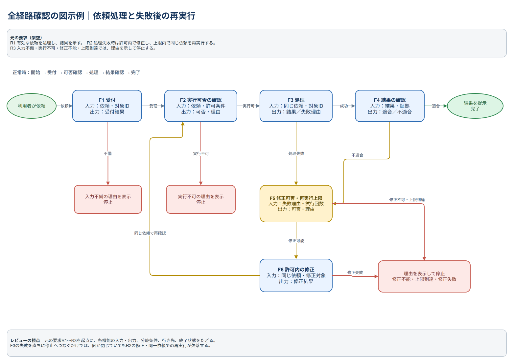

# TIPS：全経路を示す図の例

この作例は架空の依頼処理を扱う。G4の全経路確認に図を使う場合の一例であり、図の形式や作図ツールを指定しない。図だけで要求の充足や実動作を証明したことにはならない。

架空の要求:

- R1：有効な依頼を処理し、結果を利用者へ示す。
- R2：処理に失敗した場合、許可された範囲で修正し、同じ依頼を再実行する。再実行には上限を設ける。
- R3：入力不備、実行不可、修正不能又は上限到達の場合は、理由を示して停止する。

[編集できるDraw.io図](full-path-review-diagram.drawio)

各機能の入出力に加え、失敗後の修正、許可条件の再確認、同じ依頼への復帰、修正できない場合の停止を一続きで示した。元の要求R1～R3を起点に、分岐条件、機能間で渡す情報、行き先、終了状態をたどる。

例えばF3の失敗を直ちに停止へつなぐだけでは、図の中で経路が完結していてもR2の修正・同一依頼での再実行が欠落する。図が閉じていることと、要求を満たすことを分けて確認する。

この作例の修正・再実行は架空の要求R2に基づくものであり、実案件に修正や再実行の権限を与えない。入力値の全組合せや設計範囲外の機能を図示する例でもない。
